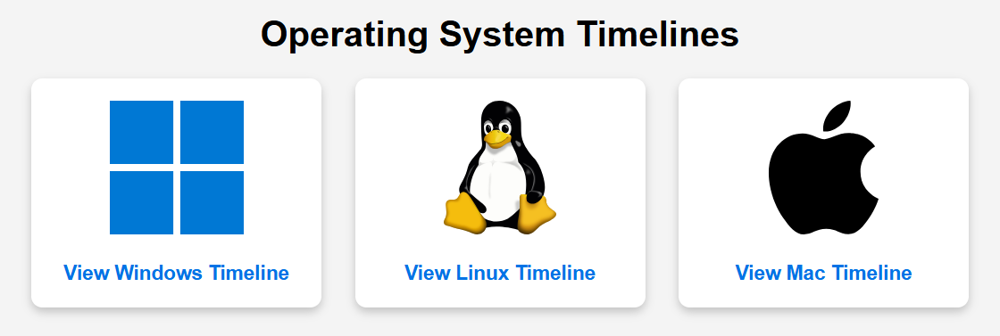

# os_timelines
Timelines of major Operating Systems

An interactive, visual history of the three major operating system families: **Windows**, **Linux**, and **macOS**. This project utilizes [TimelineJS3](https://timeline.knightlab.com/) to create a rich, media-heavy exploration of computing history. Details on usage of TimelineJS are available at the project's page.

You can view the main landing page and navigate to the individual timelines here:
**https://presack.github.io/os_timelines/**

## Project Structure
* `index.html`: The main landing page with tiles for each OS.
* `windows_timeline.html`, `apple_timeline.html`, `linux_timeline.html`: The individual timeline viewers.
* `windows_timeline.json`, `apple_timeline.json`, `linux_timeline.json`: These files contain all event text, dates, and media references.
* `images/`: Local repository for all media assets (ensures long-term link stability).
